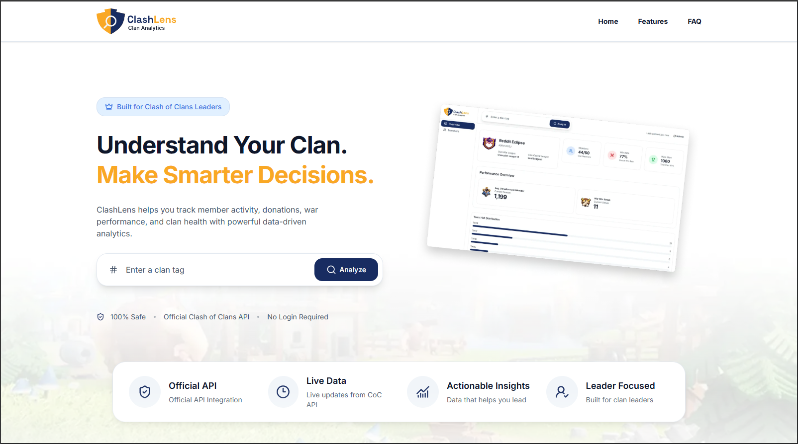
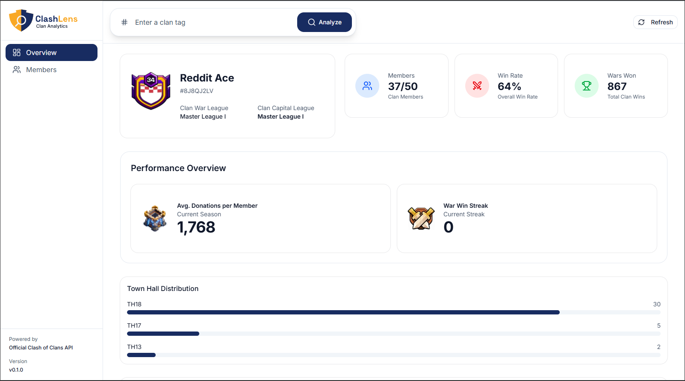
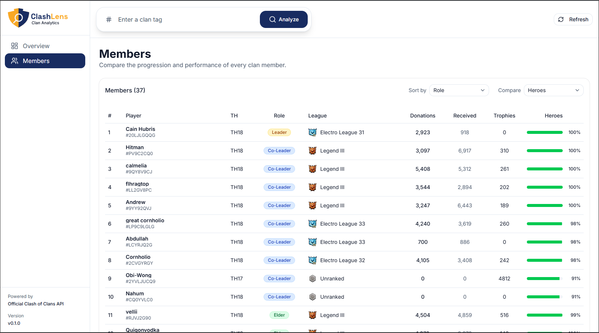

# ClashLens

> Modern analytics platform for Clash of Clans clan leaders.


ClashLens is a modern analytics platform built with **Next.js**, **TypeScript**, and **Tailwind CSS** that helps Clash of Clans clan leaders explore live clan data, compare member progression, and understand overall clan performance using the official Clash of Clans API.

---

## 🌐 Live Demo

**https://www.clashlens.app**

---

## 🎨 Design

**Figma**

https://www.figma.com/design/fRU9Ly1t93PMJQLs2VOckH/MDev?node-id=0-1&t=HGOHCZ7XpHUQBjuC-1

---

# Features

## Available Today

### Dashboard

- Live clan overview
- Clan summary
- Performance overview
- Town Hall distribution
- League distribution
- Current war snapshot
- Quick highlights

### Members

- Member comparison
- Progress comparison
- Sorting
- Responsive member table

### Platform

- Live Clash of Clans API integration
- Server-side data fetching
- Responsive design
- Mobile-first UI
- Modern component architecture

---

## Planned

### Phase 2

- Decision support framework
- Player evaluation engine
- Recommendation system

### Phase 3

- PostgreSQL integration
- Historical clan tracking
- Trend analysis
- Background synchronization

### Phase 4

- AI-powered recommendations
- Clan health analysis
- Weekly reports
- Monthly reports

---

# Screenshots

## Landing Page



## Dashboard Overview



## Members



---

# Architecture

- Next.js App Router
- Server Components by default
- Client Components for interactive features
- Route Handlers
- Feature-based architecture
- Service layer
- Shared TypeScript domain models
- Tailwind CSS + shadcn/ui

---

# Documentation

Project documentation is organized into three sections.

## 📦 Product

- [Product Vision](docs/01-product/01-product-vision.md)
- [MVP Roadmap](docs/01-product/02-mvp-roadmap.md)
- [Available Data Inventory](docs/01-product/03-available-data-inventory.md)

## 🎨 Design

- [Information Architecture](docs/02-design/01-information-architecture.md)
- [Page Specifications](docs/02-design/02-page-specifications.md)
- [Component Inventory](docs/02-design/03-component-inventory.md)

## ⚙️ Engineering

- [Technical Architecture](docs/03-engineering/01-technical-architecture.md)
- [Development Principles](docs/03-engineering/02-development-principles.md)

---

# Tech Stack

| Category        | Technology                |
| --------------- | ------------------------- |
| Framework       | Next.js 16                |
| UI              | React 19                  |
| Language        | TypeScript                |
| Styling         | Tailwind CSS 4            |
| Components      | shadcn/ui                 |
| Icons           | Lucide React              |
| Routing         | App Router                |
| API             | Route Handlers            |
| Package Manager | pnpm                      |
| Deployment      | Vercel                    |
| Data Source     | Clash of Clans Public API |

---

# Project Structure

```text
app/
components/
services/
lib/
types/
docs/
public/
```

---

# Project Goals

- Build a production-grade Next.js application
- Apply modern React and App Router architecture
- Integrate with the official Clash of Clans API
- Provide meaningful analytics for clan leaders
- Build a scalable foundation for future historical analytics and intelligent recommendations

---

# Getting Started

## 1. Install dependencies

```bash
pnpm install
```

## 2. Create a local environment file

Copy `.env.example` to `.env.local`.

### macOS / Linux

```bash
cp .env.example .env.local
```

### Windows (PowerShell)

```powershell
Copy-Item .env.example .env.local
```

## 3. Configure environment variables

Generate an API key from the Clash of Clans Developer Portal.

Add your credentials to `.env.local`.

```env
COC_API_TOKEN=
COC_API_BASE_URL=
NEXT_PUBLIC_APP_URL=
```

## 4. Start the development server

```bash
pnpm dev
```

Visit:

```
http://localhost:3000
```

---

# Available Scripts

| Command             | Description                  |
| ------------------- | ---------------------------- |
| `pnpm dev`          | Start the development server |
| `pnpm build`        | Create a production build    |
| `pnpm start`        | Start the production server  |
| `pnpm lint`         | Run ESLint                   |
| `pnpm format`       | Format the project           |
| `pnpm format:check` | Check formatting             |
| `pnpm check`        | Run project checks           |

---

# Roadmap

## ✅ Phase 1 — Live Analytics

- [x] Responsive landing page
- [x] Live clan search
- [x] Clash of Clans API integration
- [x] Dashboard overview
- [x] Members page
- [x] Responsive interface
- [x] Vercel deployment

---

## 🚧 Phase 2 — Decision Support

- [ ] Evaluation framework
- [ ] Player scoring
- [ ] Recommendation engine

---

## 📈 Phase 3 — Historical Analytics

- [ ] PostgreSQL integration
- [ ] Historical clan tracking
- [ ] Trend analysis
- [ ] Scheduled synchronization

---

## 🤖 Phase 4 — Intelligent Insights

- [ ] AI-powered recommendations
- [ ] Clan health analysis
- [ ] Weekly reports
- [ ] Monthly reports

---

# License

This project is licensed under the **MIT License**.

---

# Author

**Mukteswar Tripathy**

GitHub: https://github.com/mukteswar-git
