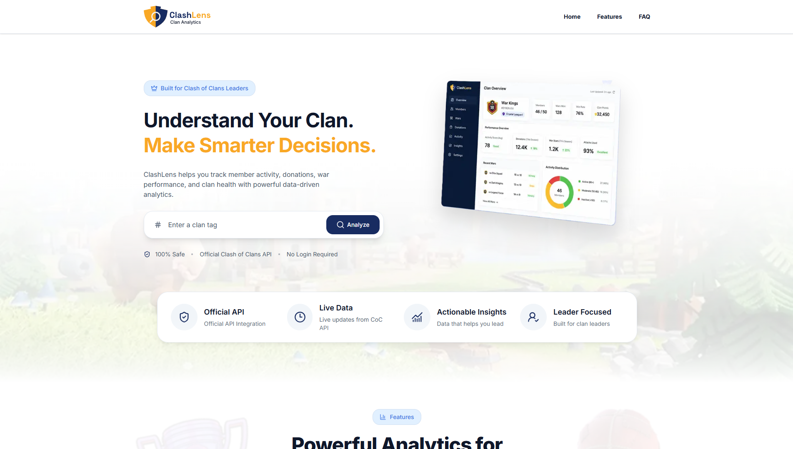
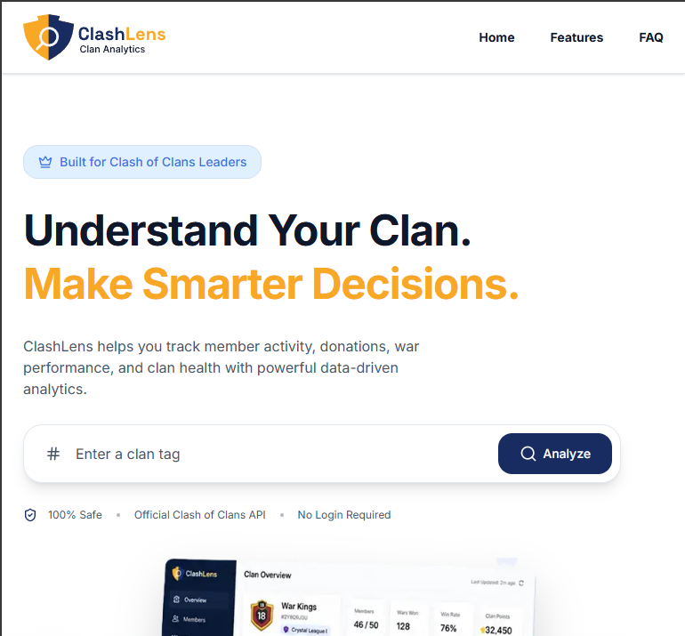
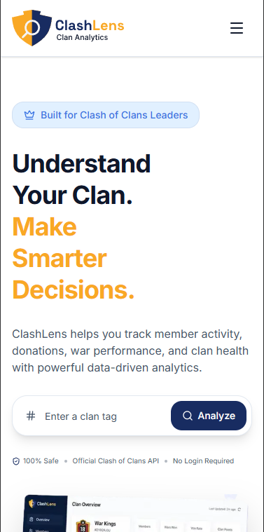

# ClashLens

> Modern analytics and decision-support platform for Clash of Clans clan leaders.

ClashLens is a web application being built with Next.js, TypeScript, and Tailwind CSS to help Clash of Clans clan leaders analyze member activity, war performance, and overall clan health using data from the official Clash of Clans API.

## Live Demo

🌐 **Live Demo:** https://clashlens.vercel.app

## 🎨 Design

🔗 **Figma Design:** https://www.figma.com/design/fRU9Ly1t93PMJQLs2VOckH/MDev?node-id=0-1&t=HGOHCZ7XpHUQBjuC-1

## Status

🚧 Currently under development.

- [x] UI/UX Design Completed
- [x] Landing Page Development
- [x] Vercel Deployment
- [ ] Dashboard Development
- [ ] Clash of Clans API Integration
- [ ] Analytics Engine

The responsive landing page has been completed and deployed. Development is now focused on the analytics dashboard and Clash of Clans API integration.

## Screenshots

### Landing Page



### Tablet



### Mobile



## Current Features

- Responsive landing page
- Mobile navigation
- Feature showcase
- FAQ section
- Modern UI built with Tailwind CSS and shadcn/ui
- Responsive design for desktop, tablet, and mobile

## Planned Features

### Live Analytics

- Clan overview
- Member exploration
- Player profiles
- War analytics

### Historical Analytics

- Historical tracking
- Trend analysis
- Weekly reports

### Intelligent Insights

- Promotion recommendations
- Removal recommendations
- Clan health analysis

## 📚 Documentation

Project documentation is organized into three categories.

### 📦 Product

- [Product Vision](docs/01-product/product-vision.md)
- [MVP Roadmap](docs/01-product/mvp-roadmap.md)
- [Available Data Inventory](docs/01-product/available-data-inventory.md)

### 🎨 Design

- [Information Architecture](docs/02-design/information-architecture.md)
- [Page Specifications](docs/02-design/page-specifications.md)
- [Component Inventory](docs/02-design/component-inventory.md)

### ⚙️ Engineering

- [Technical Architecture](docs/03-engineering/technical-architecture.md)
- [Development Principles](docs/03-engineering/development-principles.md)

## Tech Stack

- Next.js 16
- React 19
- TypeScript
- Tailwind CSS 4
- shadcn/ui
- Lucide React
- App Router
- Route Handlers
- pnpm
- Vercel

## Project Goals

- Build a production-grade Next.js application
- Integrate with the official Clash of Clans API
- Create meaningful analytics and decision-support features
- Practice modern full-stack development patterns
- Deploy on Vercel

## Getting Started

Install dependencies:

```bash
pnpm install
```

Start the development server:

```bash
pnpm dev
```

Open:

```text
http://localhost:3000
```

Build for production:

```bash
pnpm build
```

## Roadmap

### Phase 1 — Live Analytics

- [x] Project setup
- [x] Responsive landing page
- [x] Vercel deployment
- [ ] Clan search
- [ ] Live clan dashboard
- [ ] Members page
- [ ] Player profile
- [ ] War page

### Phase 2 — Decision Engine Design

- [ ] Evaluation framework
- [ ] Decision rules
- [ ] Recommendation criteria

### Phase 3 — Historical Analytics

- [ ] Clan tracking
- [ ] PostgreSQL integration
- [ ] Historical reports
- [ ] Background synchronization

### Phase 4 — Smart Recommendations

- [ ] Promotion recommendations
- [ ] Removal recommendations
- [ ] Clan health analysis
- [ ] Weekly and monthly reports

## License

MIT License

## Author

Mukteswar Tripathy
